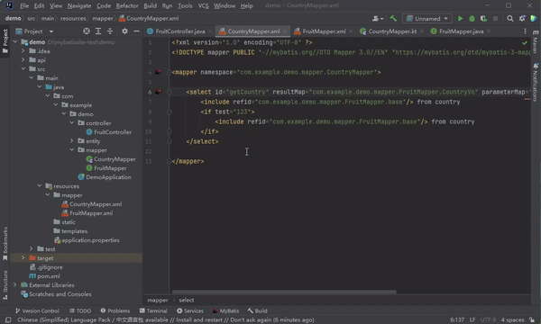

#  MyBatiSuite

***Note: To run the source code, create a `Packages` folder in JDK root path if not exist.***

Get from [Marketplace](https://plugins.jetbrains.com/plugin/25744-mybatisuite)

<!-- Plugin description -->
This plugin provides MyBatis supports for IntelliJ IDEA.

## Features
- Java Code and XML Mapper Navigation
- XML Mapper `sql`, `include`, `parameterMap` and `resultMap` Navigation
- SQL Log Catching
- XML Mapper and Configuration File Templates
- Kotlin Support
<!-- Plugin description end -->

## Usage
Code navigation:

Open SQL log catching:

Using file templates:

## Donation
Support me by AFDIAN: https://afdian.com/a/caiqichang
